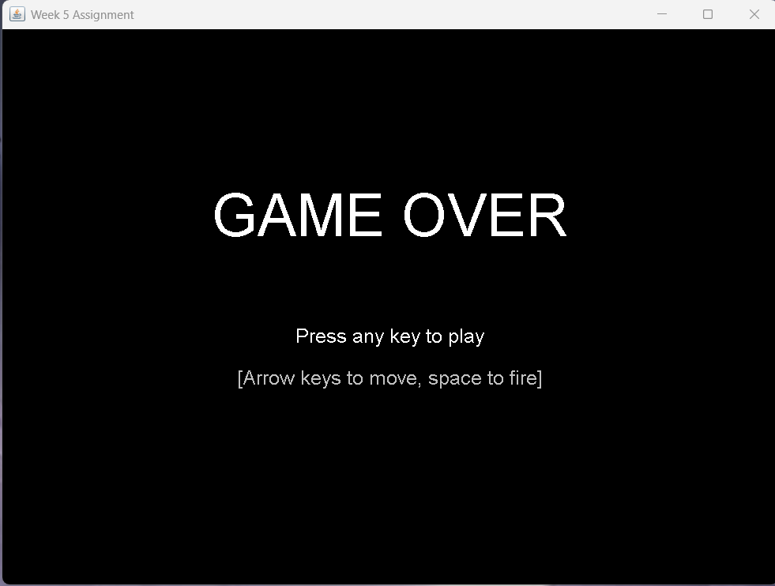
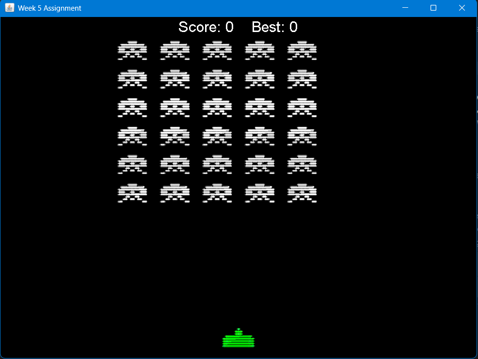
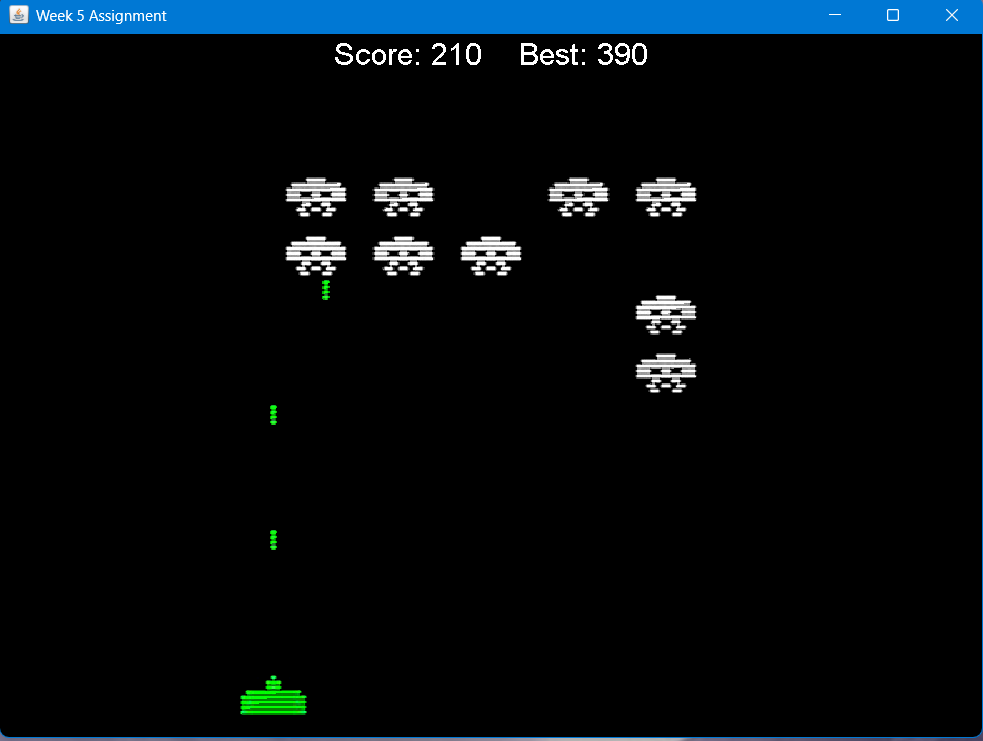

# Space Invaders
 University project - 2nd year  
 A simple Space Invaders game built using Java Swing. Features include player movement (left/right), shooting mechanics, enemy waves, collision detection, game-over conditions and a scoreboard.

 Here are some images of the game in motion

 ## Main Screen / GAME OVER Screen

## Start of Game

## During Game

